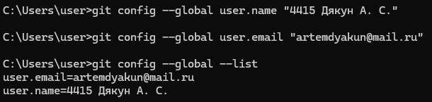
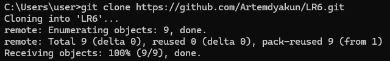
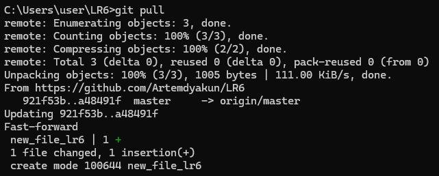
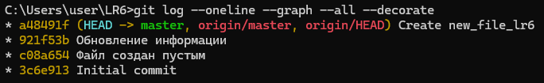
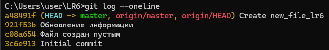

# LR6
Лабораторная работа №6

В ходе выполнения лабораторной работы были последовательно выполнены следующие действия:

1. Работа велась под использованием собственного аккаунта GitHub.  

2. Исходный репозиторий был скопирован в личное хранилище с помощью Fork.  

3. На пк уже был установлен Git-клиент.

4. Выполнена первичная конфигурация Git (заданы имя пользователя и адрес электронной почты) через команды `git config`.  
   

5. Личный форк репозитория был клонирован на ПК с помощью команды `git clone`.  
   

6. Через веб-интерфейс GitHub был создан дополнительный файл, после чего изменения подтянуты в локальный репозиторий командой `git pull`.  
   

7. Для всех существующих веток получена история коммитов в компактном и наглядном виде с использованием команды  
   `git log --oneline --graph --all`.  
   

8. Просмотрены последние изменения в репозитории с помощью команд `git status` и `git log --oneline`.  
   

