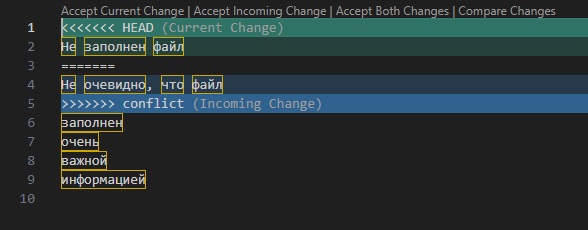
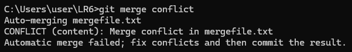
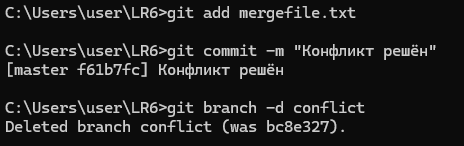
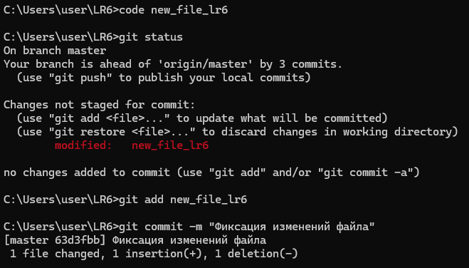
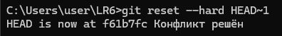
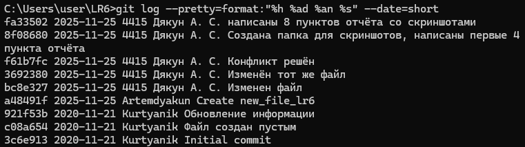

# LR6
Лабораторная работа №6

В ходе выполнения лабораторной работы были последовательно выполнены следующие действия:

1. Работа велась под использованием собственного аккаунта GitHub.  

2. Исходный репозиторий был скопирован в личное хранилище с помощью Fork.  

3. На пк уже был установлен Git-клиент.

4. Выполнена первичная конфигурация Git (заданы имя пользователя и адрес электронной почты) через команды `git config`.  
   

5. Личный форк репозитория был клонирован на ПК с помощью команды `git clone`.  
   

6. Через веб-интерфейс GitHub был создан дополнительный файл, после чего изменения подтянуты в локальный репозиторий командой `git pull`.  
   

7. Для всех существующих веток получена история коммитов в компактном и наглядном виде с использованием команды  
   `git log --oneline --graph --all`.  
   

8. Просмотрены последние изменения в репозитории с помощью команд `git status` и `git log --oneline`.  
   

9. Выполнено слияние побочной ветки с основной веткой `master`, намеренно создан конфликт в файле и затем вручную разрешён с использованием Git и текстового редактора.  
   
    

10. После успешного объединения изменений ненужная побочная ветка была удалена.  
    

11. В репозитории были внесены дополнительные правки в файлы и несколько раз выполнены коммиты с поясняющими комментариями.  
    

12. Для демонстрации отката изменений был выполнен откат одного из коммитов с помощью`git reset`.
    

13. Создана отдельная ветка для оформления отчёта по лабораторной работе, например командой `git checkout -b report`.  

14. Сформирована отформатированная история операций в удобном для вставки в отчёт виде с использованием, например, команды  
    `git log --pretty=format:"%h %ad %an %s" --date=short`.  
    

15. Все локальные изменения (включая отчёт и вспомогательные файлы) подготовлены к отправке и выгружены в удалённый репозиторий командой `git push`.

---

## Лог команд


```bash
git config --global user.name "4415 Дякун А. С."
git config --global user.email "artemdyakun@mail.ru"
git config --global --list
git clone https://github.com/Artemdyakun/LR6.git
cd LR6
git pull
git branch
git log --oneline
git log --oneline --graph --all --decorate
git show
git diff HEAD~1 HEAD
code mergefile.txt
git checkout -b conflict
code mergefile.txt
git status
git add mergefile.txt
git commit -m "Изменен файл"
git checkout master
code mergefile.txt
git status
git add mergefile.txt
git commit -m "Изменён тот же файл"
git branch
git merge conflict
code mergefile.txt
git status
git add mergefile.txt
git commit -m "Конфликт решён"
git branch -d conflict
code new_file_lr6
git status
git add new_file_lr6
git commit -m "Фиксация изменений файла"
git reset --hard HEAD~1
git checkout -b otchet
code README.md
git add .
git commit -m "Создана папка для скриншотов, написаны первые 4 пункта отчёта"
git add .
git commit -m "написаны 8 пунктов отчёта со скриншотами"
git log --pretty=format:"%h %ad %an %s" --date=short
doskey /history
```